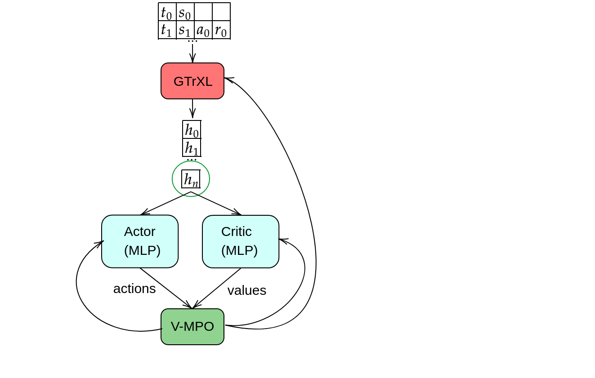

# Transformers applied to RL tasks
Transformers learned with reinforce and V-MPO
## VMPO
### GTrXL transformer

Run `tests/gtrxl_test.py` with `--state_rep=gtrxl`
### CoBERL
Run `tests/gtrxl_test.py` with `--state_rep=coberl` to run the architecture with CoBERL in the place of GTrXL in architecture
## Reinforce
To run the GTrXL as a policy-estimating network, run `pg.py` with bool `Trans=True` within. To evaluate the common MLP estimation, set this bool `Trans=False`. 